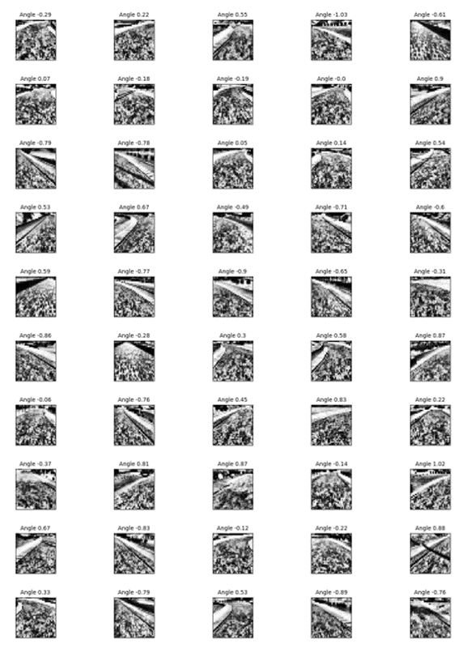

Project 3, Term 1: Use Deep Learning to Clone Driving Behavior
=================================================

Final Result
--------------

Required Files
--------------

#### Are all required files submitted?

This git repository contains:
-   A model.py file
-   A drive.py file
-   A model.h5 file
-   A video.mp4 file
-   A writeup report (markdown)

Quality of Code
---------------------

#### Is the code functional?

The model provided can be used to successfully operate the simulation.

#### Is the code usable and readable?

The code in model.py uses a Python generator to generate data for training rather than storing the training data in memory. The model.py code is clearly organized and comments are included where needed.

Model Architecture and Training Strategy
---------------------

#### Has an appropriate model architecture been employed for the task?

The neural network (see below), adapted from the Traffic Sign Classifier project, uses convolution layers with appropriate filter sizes. Layers exist to introduce nonlinearity into the model.

|Layer (type) |Output Shape |Param # |
| --- | --- |---: |
|lambda_1 (Lambda)            |(None, 32, 32, 1)         |0
|conv2d_1 (Conv2D)            |(None, 30, 30, 32)        |320
|conv2d_2 (Conv2D)            |(None, 28, 28, 32)        |9248
|max_pooling2d_1 (MaxPooling2) |(None, 14, 14, 32)        |0
|conv2d_3 (Conv2D)            |(None, 12, 12, 64)        |18496
|conv2d_4 (Conv2D)            |(None, 10, 10, 64)        |36928
|max_pooling2d_2 (MaxPooling2) |(None, 5, 5, 64)          |0
|conv2d_5 (Conv2D)            |(None, 3, 3, 128)         |73856
|max_pooling2d_3 (MaxPooling2) |(None, 1, 1, 128)         |0
|flatten_1 (Flatten)          |(None, 128)               |0
|dense_1 (Dense)              |(None, 128)               |16512
|dropout_1 (Dropout)          |(None, 128)               |0
|dense_2 (Dense)              |(None, 64)                |8256
|dropout_2 (Dropout)          |(None, 64)                |0
|dense_3 (Dense)              |(None, 32)                |2080
|dropout_3 (Dropout)          |(None, 32)                |0
|dense_4 (Dense)              |(None, 1)                 |33

##### Dataset characteristics

The top 60 pixels and bottom 30 pixels of each frame are trimmed.  Each frame is split into 7 images.  Each image is 70 pixels tall and 160 pixels wide.  They are created from the frame as follows:

|image|left|right|
|:---:|---:|---:|
|1|0|160
|2|20|180
|3|50|210
|4|80|240
|5|110|270
|6|140|300
|7|160|320

The images are then greyscaled. Contast Limited Adaptive Histogram Equalization and Histogram Equalization algorithms are applied.  The data is then normalized and reshaped to a size of 32x32x1.

Sample Processed Images:

#### Has an attempt been made to reduce overfitting of the model?

Train/validation splits were used, and the model uses dropout layers and max pooling to reduce overfitting.

The model was terminated at 30 EPOCHS.  In the last EPOCH, the training loss was greater than the validation loss, which indicates the model is not overfitted.  The model was stopped at 30 EPOCHS because the loss between EPOCHS improved by only .007.  The model was predicting almost 97% of the images correctly when it was terminated.

**Epoch 29/30**

10/10 [==============================] - 2815s 281s/step - loss: 0.0324 - val_loss: 0.0135

**Epoch 30/30**

10/10 [==============================] - 2804s 280s/step - loss: 0.0317 - val_loss: 0.0125

#### Have the model parameters been tuned appropriately?

An Adam optimizer was used with an initial learning rate of .0005 and an exponential decay in the learning rate of .95.

#### Is the training data chosen appropriately?

Training was accomplished by selecting the easy course and driving the track in both directions.  Each time the course was driven, the curves at the end of the course (or the beginning depending upon the direction travelled) were driven twice and the rest of the course was driven once.

Architecture and Training Documentation
------------

#### Is the solution design documented?

This README thoroughly discusses the approach taken for deriving and designing a model architecture fit for solving the given problem.

#### Is the model architecture documented?

This README provides sufficient details of the characteristics and qualities of the architecture, such as the type of model used, the number of layers, and the size of each layer.

#### Is the creation of the training dataset and training process documented?

This README describes how the model was trained and what the characteristics of the dataset are. Information such as how the dataset was generated and examples of images from the dataset must be included.

Simulation
--------------
#### Is the car able to navigate correctly on test data?

No tire leaves the drivable portion of the track surface. The car does not pop up onto ledges or roll over any surfaces that would otherwise be considered unsafe (if humans were in the vehicle).

